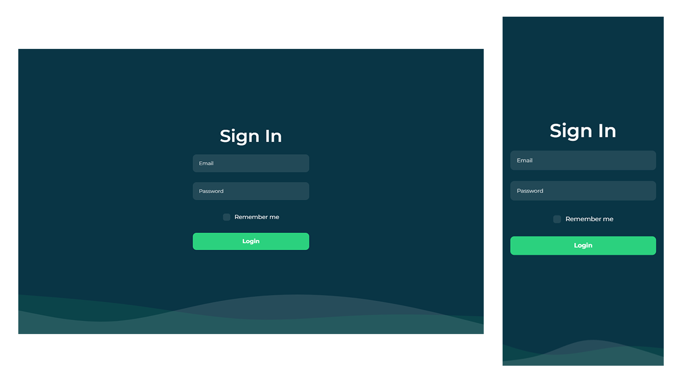

# MOVIE DATABASE

This is for an Upwork assignment to apply for the position of Senior Full-stack Developer.

The stack used in this project includes `Next.js` for the frontend, `Nest.js` for the backend, and `SQLite` for the database.

This project can be run using Docker or a conventional approach. Instructions for installation are explained in each stack directory: `backend` and `frontend` directories.

## Screenshot

## Features
- Login & Logout
- Auth guard middleware
- CRUD movies with upload file handler
- Responsive views
- Github auto-deployment to EC2
- Local and Docker environment supported

## Tech Stacks:
- Full-stack javascript
- Frontend: Next.js v14
- Backend: Nest.js
- ORM: Next.js Mikro-ORM, support migration and seeder
- Database: SQLite (you can change to whatever database you like)
- Typescript

## Live preview
You can see live preview [here](http://43.218.241.82:8081/)
